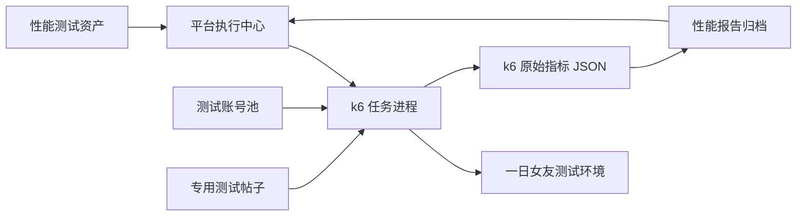

# 一日女友登录、浏览与点赞压测设计

**日期：** 2026-08-16

**范围：** 一日女友项目的登录、浏览、浏览记录与点赞接口；平台新增性能测试资产和执行报告能力。

## 目标

在隔离测试环境中，验证登录、动态浏览及已登录点赞链路在目标并发下的容量、稳定性、计数一致性与恢复能力。默认容量基线为 100 并发虚拟用户，执行 15 分钟的分阶段压测。

当前平台的接口批量执行器用于串行回归和证据采集，不承担高并发调度。压测使用 k6 作为独立执行引擎，平台负责资产配置、任务发起、过程状态和报告归档。

## 范围与边界

### 覆盖接口

| 模块 | 接口 | 请求比例 | 主要验证点 |
| --- | --- | ---: | --- |
| 登录 | `POST /api/login` | 10% | 登录成功率、Token 完整性、P95、错误码分布 |
| 列表浏览 | `GET /api/feed/list` | 35% | 分页可用性、响应时间、缓存与空数据兼容 |
| 详情浏览 | `GET /api/post/:id` | 35% | 内容完整性、详情可用性、P95 |
| 浏览记录 | `POST /api/profile/history` | 10% | 已登录写入、幂等/去重、写入延迟、限流 |
| 点赞 | `POST /api/post/:id/interaction` | 10% | 已登录鉴权、单账号幂等、最终计数一致性 |

### 明确不做

- 不使用匿名点赞、伪造 Cookie、多账号运行时注册或其他方式绕过鉴权、限流和风控。
- 不使用真实用户、生产账号、生产帖子、支付或删除接口。
- 不以“点赞数被批量增加”作为容量通过条件；点赞仅验证授权账号的幂等与一致性。
- 不将密码、Token、账号池明文写入源码、报告、Git 或 k6 日志。

匿名 `POST /api/post/:id/interaction` 当前返回 `200 + ok:true` 的问题保留为一次、无副作用的安全探针。该探针失败即 P0，不能混入持续压测流量。

## 方案对比

1. **k6 执行器 + 平台报告回写（采用）**：提供分阶段升压、VU 隔离、阈值、趋势指标和标准结果输出；平台保留现有项目、权限、报告和数据包能力。
2. **Node 并发脚本**：可快速调试，但并发控制、指标聚合、连接复用和扩展能力较弱，不作为正式压测方案。
3. **复用现有批量接口测试**：保持串行语义，不能模拟真实并发，不采用。

## 架构与数据流

性能资产保存项目 ID、目标环境、场景权重、账号池引用、帖子数据集、升压阶段、阈值和安全探针开关。账号池仅保存受控环境中的账号引用；运行时由 SQLite 配置服务解密/注入，报告仅显示脱敏账号标识。

每个虚拟用户在迭代开始时选取一个独立预置账号并完成登录，然后在该迭代内复用 Token。浏览和写入仅命中本次创建或指定的测试帖子集合。对于点赞，每个账号只对指定帖子发起一次点赞；重复请求必须返回可解释结果且不能重复增加计数。

## 执行阶段与阈值

| 阶段 | 并发 VU | 时长 | 目的 |
| --- | ---: | ---: | --- |
| 基线 | 20 | 3 分钟 | 建立正常响应与资源基线 |
| 常规负载 | 50 | 5 分钟 | 验证典型高峰负载 |
| 峰值 | 100 | 5 分钟 | 验证目标容量 |
| 恢复 | 20 | 2 分钟 | 确认资源回落与服务恢复 |

| 指标 | 通过阈值 |
| --- | --- |
| 登录、列表、详情成功率 | >= 99.5% |
| 浏览记录、点赞成功率 | >= 99.0% |
| 登录、列表、详情 P95 | <= 1.5 秒 |
| 浏览记录、点赞 P95 | <= 2 秒 |
| HTTP 5xx 占比 | < 0.1% |
| Token 解析/刷新失败 | 0 |
| 点赞数据 | 同账号幂等，最终计数不倒退，结果可与服务端查询对账 |

阈值以压测前的服务端监控基线为准；若测试环境基础资源不足，报告标记为“环境容量不足”，不能将结果解释为应用容量结论。

## 平台页面与报告

测试资产新增“性能测试”筛选和编辑入口，字段包括名称、项目、环境、数据集、阶段、阈值、启用状态。执行中心展示当前阶段、活动 VU、已完成迭代、请求数、错误数、P95 和停止原因。

报告保存：环境、代码版本、执行窗口、阶段趋势、接口维度指标、错误样本（脱敏）、服务端监控链接、阈值判定、测试数据 ID 和回滚/清理结果。报告状态为通过、带风险或失败；不输出认证头、Token、密码或完整用户数据。

## 验收用例

| 用例 ID | 优先级 | 测试类型 | 测试场景 | 前置条件 | 测试步骤 | 预期结果 | 证据 |
| --- | --- | --- | --- | --- | --- | --- |
| DAYGF-PERF-001 | P0 | 容量 | 100 VU 混合场景 | 账号池、测试帖子、监控可用 | 按四阶段执行 | 所有核心阈值满足 | k6 指标与平台报告 |
| DAYGF-PERF-002 | P0 | 鉴权 | 匿名点赞探针 | 独立探针帖子 | 单次无 Token 请求 | 返回 401；否则记录 P0 | 脱敏请求/响应 |
| DAYGF-PERF-003 | P1 | 一致性 | 单账号点赞幂等 | 已登录测试账号 | 同一帖子连续点赞两次并查询 | 计数仅按产品规则变化，无重复累加 | 接口证据与最终查询 |
| DAYGF-PERF-004 | P1 | 稳定性 | 峰值后的恢复 | 完成峰值阶段 | 降至 20 VU 并持续 2 分钟 | P95 和错误率恢复至基线区间 | 阶段趋势图 |
| DAYGF-PERF-005 | P1 | 限流 | 浏览记录受控限流 | 测试账号与帖子 | 按设计速率发送记录请求 | 限流响应可识别、无 5xx、无数据异常 | 接口分布与服务端日志 |

## 发布门禁与回滚

- P0 鉴权探针必须通过；匿名写入成功时判定不可发布。
- P0/P1 性能用例全部通过，或 P1 获得正式豁免并记录风险。
- 压测期间无不可解释的 5xx、数据库锁等待积压、连接耗尽或数据损坏。
- 执行前保存测试帖子与账号池的初始状态；执行后按测试环境策略清理或归档。
- 任一阶段错误率超过 2%、P95 超阈值两倍、服务端资源持续饱和或发现数据异常时立即停止任务，保留证据并恢复测试数据。

## 结论

在具备预置账号池、专用测试帖子、服务端监控和可执行清理策略前，本方案不能进入正式压测。实现后以 k6 原始指标和平台归档报告共同作为容量结论依据。
